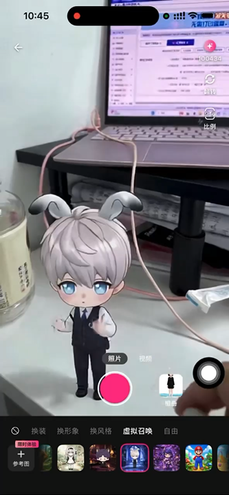

<p align="center">
  
</p>

<p align="center">
  <a href="https://developer.mozilla.org/en-US/docs/Web/JavaScript"></a>
  <a href="https://platform.xmaxai.com/"></a>
  <a href="./LICENSE"></a>
</p>

We introduce XmaxSDK, a JavaScript SDK designed for real-time interactive video generation via Xmax models. XmaxSDK implements an end-to-end pipeline covering media acquisition, video streaming, frame-by-frame generation, and on-device rendering, enabling developers to seamlessly integrate low-latency, high-fidelity video transformations into creative applications at a much lower cost than alternative solutions.

<p align="center"></p>

<br>

## What you can build with XmaxSDK

<table>
  <tr>
    <th width="24%" align="left">Realtime Use Case</th>
    <th width="60%" align="left">Description</th>
    <th width="16%" align="center">Demo</th>
  </tr>
  <tr>
    <td rowspan="2" width="24%" valign="middle">
      <strong>Character Swapping</strong>
    </td>
    <td width="60%" valign="middle">
      Replace anyone in your live feed with a designated avatar in real-time.
    </td>
    <td rowspan="2" width="16%" align="center" valign="middle">
      <a href="./docs/videos/use-cases/character-swapping.mp4">
        
        <br>
        <sub>▶ Play demo</sub>
      </a>
    </td>
  </tr>
  <tr>
    <td width="60%" valign="middle">
      <strong>Prompt:</strong> <code>视频中角色替换成参考图中角色</code>
      <br><br>
      <strong>Reference image:</strong> Select a clear image of the desired character with a clean background.
    </td>
  </tr>
  <tr>
    <td rowspan="2" width="24%" valign="middle">
      <strong>Virtual Try-On</strong>
    </td>
    <td width="60%" valign="middle">
      Seamlessly change outfits, preserving exact body shape, natural motion, and an
      authentic fit.
    </td>
    <td rowspan="2" width="16%" align="center" valign="middle">
      <a href="./docs/videos/use-cases/virtual-try-on.mp4">
        
        <br>
        <sub>▶ Play demo</sub>
      </a>
    </td>
  </tr>
  <tr>
    <td width="60%" valign="middle">
      <strong>Prompt:</strong> <code>视频中人物衣服替换成参考图中衣服</code>
      <br><br>
      <strong>Reference image:</strong> Select a clear image of the target outfit with a clean background.
    </td>
  </tr>
  <tr>
    <td rowspan="2" width="24%" valign="middle">
      <strong>Video Restyling</strong>
    </td>
    <td width="60%" valign="middle">
      Reimagine your world in any style with an immersive visual experience.
    </td>
    <td rowspan="2" width="16%" align="center" valign="middle">
      <a href="./docs/videos/use-cases/video-restyling.mp4">
        
        <br>
        <sub>▶ Play demo</sub>
      </a>
    </td>
  </tr>
  <tr>
    <td width="60%" valign="middle">
      <strong>Prompt:</strong> <code>视频风格变为参考图指定的风格</code>
      <br><br>
      <strong>Reference image:</strong> Select an image that captures the artistic style you want to apply.
    </td>
  </tr>
  <tr>
    <td rowspan="2" width="24%" valign="middle">
      <strong>AI Companions</strong>
    </td>
    <td width="60%" valign="middle">
      Summon virtual characters into your live camera feed and interact with them
      through gestures.
    </td>
    <td rowspan="2" width="16%" align="center" valign="middle">
      <a href="./docs/videos/use-cases/ai-companions.mp4">
        
        <br>
        <sub>▶ Play demo</sub>
      </a>
    </td>
  </tr>
  <tr>
    <td width="60%" valign="middle">
      <strong>Prompt:</strong> <code>指定角色在场景中互动</code>
      <br><br>
      <strong>Reference image:</strong> Select a clear image of the virtual character you want to summon with a clean background.
    </td>
  </tr>
  <tr>
    <td rowspan="2" width="24%" valign="middle">
      <strong>Live Photo</strong>
    </td>
    <td width="60%" valign="middle">
      Animate and control characters in your images simply by drawing motion
      trajectories.
    </td>
    <td rowspan="2" width="16%" align="center" valign="middle">
      <a href="./docs/videos/use-cases/live-photo.mp4">
        
        <br>
        <sub>▶ Play demo</sub>
      </a>
    </td>
  </tr>
  <tr>
    <td width="60%" valign="middle">
      <strong>Prompt:</strong> <code>让画面自然动起来</code>
      <br><br>
      <strong>Reference image:</strong> Use the input image as the reference
    </td>
  </tr>
</table>

<br>

## Why XmaxSDK?

<table>
  <thead>
    <tr>
      <th height="104" align="center" valign="middle">
        <br>Low latency
      </th>
      <th height="104" align="center" valign="middle">
        <br>Cost efficiency
      </th>
      <th height="104" align="center" valign="middle">
        <br>High fidelity
      </th>
    </tr>
  </thead>
  <tbody>
    <tr>
      <td>End-to-end latency is measured in , ensuring that updates to generation conditions and interaction controls are reflected instantly.</td>
      <td>Run on a , reducing inference costs by orders of magnitude versus datacenter GPUs like H100.</td>
      <td>Our models support real-time generation at up to , delivering production-ready, high-quality video output.</td>
    </tr>
  </tbody>
</table>

<br>

## Prerequisites

- A WebRTC-enabled browser running on HTTPS or localhost
- Node.js 18 or later, with pnpm or npm for development
- An Xmax API key

> [!WARNING]
> Never commit your Xmax API key to version control or embed a long-lived key in
> client-side bundles. Use short-lived temporary keys issued by your backend
> through the Xmax API. For step-by-step
> instructions, see [Authentication](https://platform.xmaxai.com/docs/authentication).

<br>

## Installation

```bash
npm install @xmaxai/web-sdk
```

The package includes optional React components at `@xmaxai/web-sdk/react`.
React applications use their own React installation; non-React applications do not need React.

<br>

## Quick Start

### Configure permissions

Serve your application over HTTPS or localhost and allow camera access in the
browser. When embedding the application in an iframe, allow camera access:

```html
<iframe src="https://your-app.example" allow="camera; microphone; autoplay"></iframe>
```

Configure permissions to match your application's user experience. XmaxSDK
automatically prompts for camera access when creating the video stream and throws
an `XmaxError` if permission is denied or unavailable.

<br>

### Generate and display video

The following JavaScript snippet creates a camera stream, starts real-time generation,
and binds the output to a video view. Run this within an async function in the browser,
after a user action such as clicking a Start button.

Choose a model with `RealtimeModel.x2_0` (`x2.0`),
`RealtimeModel.x2_0_pro` (`x2.0-pro`), or
`RealtimeModel.x2_0_trtc` (`x2.0-trtc`).

```javascript
import {
  CameraPosition,
  RealtimeConfiguration,
  RealtimeContext,
  RealtimeModel,
  RealtimeVideoFormat,
  VideoContentMode,
  XmaxClient,
  XmaxConfiguration,
  XmaxRealtimeVideoView,
} from "@xmaxai/web-sdk";

const client = new XmaxClient(
  new XmaxConfiguration({ apiKey: "YOUR_TEMPORARY_XMAX_API_KEY" })
);

const realtime = client.createRealtimeManager(
  new RealtimeConfiguration({ model: RealtimeModel.x2_0_trtc })
);

const localStream = await realtime.createLocalCameraStream({
  videoFormat: new RealtimeVideoFormat({ width: 1024, height: 1920, fps: 30 }),
  position: CameraPosition.front,
  useMicrophone: false,
  enableFrameValidation: true, // Optional; waits a fixed 200ms camera warmup before publishing; false skips it.
});

const videoView = new XmaxRealtimeVideoView({
  localTrack: localStream.videoTrack,
  videoContentMode: VideoContentMode.fill,
});

videoView.element.style.width = "100%";
videoView.element.style.height = "100%";
const container = document.getElementById("video-container");
if (!container) throw new Error("Missing #video-container element");
videoView.attach(container);

const remoteStream = await realtime.startGeneration({
  localStream,
  context: new RealtimeContext({
    prompt: "视频中角色替换成参考图中角色",
    referencePath: "https://platform.xmaxai.com/images/source/charx/chatx_image1.jpg",
  }),
});

videoView.remoteTrack = remoteStream.videoTrack;
```

Add a `video-container` element with an explicit width and height to your page.
The view displays a local camera preview until the first generated frame arrives.

<br>

### Using React

Use `XmaxRealtimeVideo` as your primary React view. Store the local and remote
tracks in component state, updating them dynamically as streams become available:

```jsx
import { XmaxRealtimeVideo } from "@xmaxai/web-sdk/react";
import { VideoContentMode } from "@xmaxai/web-sdk";

<XmaxRealtimeVideo
  localTrack={localTrack}
  remoteTrack={remoteTrack}
  videoContentMode={VideoContentMode.fill}
  style={{ width: "100%", height: "100%" }}
/>
```

See the [React component](./packages/xmax-sdk/src/react/XmaxRealtimeVideo.tsx) for state binding and the
[example project](#example-project) for a complete implementation.

<br>

### Listen for events

After creating `realtime`, register the listeners you need before creating the
input stream or starting generation.

| Listener | Purpose |
| --- | --- |
| `setStateListener` | Observe pipeline states and termination reasons during real-time generation. |
| `setLaunchTimingListener` | Monitor camera, connection, first-frame, and total launch timings. |
| `setLocalVideoStatisticsListener` | Monitor uplink video resolution, frame rate, and bitrate. |
| `setRemoteVideoStatisticsListener` | Monitor downlink video statistics, packet loss, playback buffer delay, RTT, and estimated RTC end-to-end delay. |

For example, monitor state changes and errors:

```javascript
await realtime.setStateListener((state) => {
  console.log("State:", state.connectionState);
  if (state.reason?.kind === "failure") {
    console.error("Error:", state.reason.error.code, state.reason.error.message);
  }
});
```

Handle errors thrown by async calls with `try/catch`. Failures that end the realtime
workflow are also available through `state.reason` after cleanup completes.

For camera input, bind the returned video track to a preview view. The SDK enters
`ready` after it has received a valid frame and the preview view is bound; observe
this through `setStateListener`.

<br>

### Resource Cleanup

- **`disconnect()` — Stop Remote Generation**

  Stops remote generation and cancels billing while keeping the local camera stream
  and preview active. Use this when ending the online session but staying on the
  current screen. You can start a new session later using the same local stream:

  ```javascript
  await realtime.disconnect();
  ```

- **`close()` — Full Teardown & Release**

  Ends the remote session, stops local media capture, and releases all engine
  resources. Use this when leaving or dismissing the generation screen:

  ```javascript
  await realtime.close();
  ```

> **Note:** These methods are alternatives, not sequential steps. When exiting a
> screen, call `close()` directly—there is no need to call `disconnect()` first.

<br>

> [!TIP]
> For complete usage examples, including camera input, reference images,
> and live statistics, see the [example project](./examples/xlab-react).

<br>

## Example Project

A complete example application featuring React is available in
[`examples/xlab-react`](./examples/xlab-react).
It demonstrates real-time generation using live camera feeds and reference images.

<br>

## Dependencies

- <ins><strong>Tencent Cloud TRTC SDK for Web</strong></ins> enables low-latency, real-time audio and video communication.
- <ins><strong>Tencent Cloud COS SDK</strong></ins> handles media upload and download via object storage.

<br>

## Contact us

For bug reports and feature requests, please open a
[GitHub Issue](../../issues). For integration
assistance and technical support, contact us at [sdk@xmax.ai](mailto:sdk@xmax.ai).

<br>

## License

XmaxSDK Web is available under the terms of the [MIT License](./LICENSE).
Third-party dependencies and model weights retain their respective licenses.
