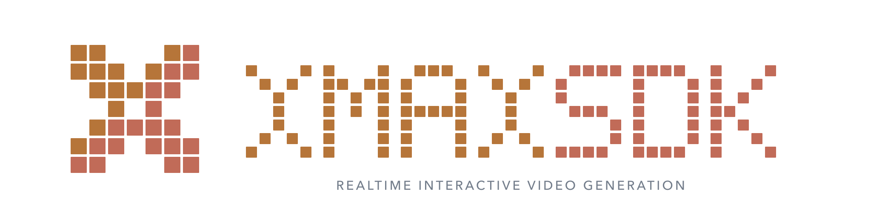
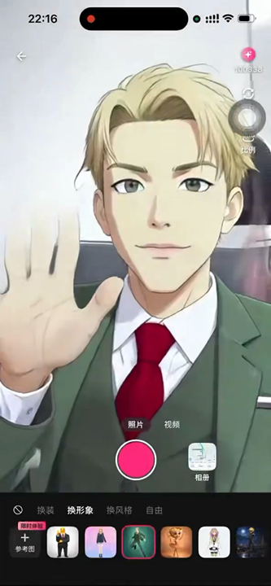
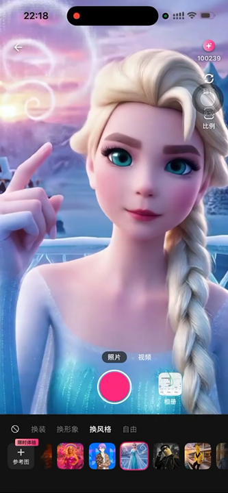
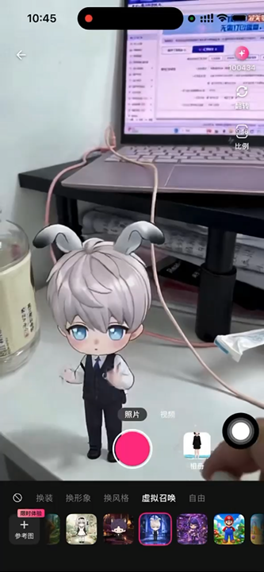

<p align="center">
  
</p>

<p align="center">
  <a href="https://developer.mozilla.org/en-US/docs/Web/JavaScript"></a>
  <a href="https://platform.xmaxai.com/"></a>
  <a href="./LICENSE"></a>
</p>

We introduce XmaxSDK, a JavaScript SDK designed for real-time interactive video generation via Xmax models. XmaxSDK implements an end-to-end pipeline covering media acquisition, video streaming, frame-by-frame generation, and on-device rendering, enabling developers to seamlessly integrate low-latency, high-fidelity video transformations into creative applications at a much lower cost than alternative solutions.

<p align="center"></p>

<br>

## What you can build with XmaxSDK

<table>
  <tr>
    <th width="24%" align="left">Realtime Use Case</th>
    <th width="60%" align="left">Description</th>
    <th width="16%" align="center">Demo</th>
  </tr>
  <tr>
    <td rowspan="2" width="24%" valign="middle">
      <strong>Character Swapping</strong>
    </td>
    <td width="60%" valign="middle">
      Replace anyone in your live feed with a designated avatar in real-time.
    </td>
    <td rowspan="2" width="16%" align="center" valign="middle">
      <a href="./docs/videos/use-cases/character-swapping.mp4">
        
        <br>
        <sub>▶ Play demo</sub>
      </a>
    </td>
  </tr>
  <tr>
    <td width="60%" valign="middle">
      <strong>Prompt:</strong> <code>视频中角色替换成参考图中角色</code>
      <br><br>
      <strong>Reference image:</strong> Select a clear image of the desired character with a clean background.
    </td>
  </tr>
  <tr>
    <td rowspan="2" width="24%" valign="middle">
      <strong>Virtual Try-On</strong>
    </td>
    <td width="60%" valign="middle">
      Seamlessly change outfits, preserving exact body shape, natural motion, and an
      authentic fit.
    </td>
    <td rowspan="2" width="16%" align="center" valign="middle">
      <a href="./docs/videos/use-cases/virtual-try-on.mp4">
        
        <br>
        <sub>▶ Play demo</sub>
      </a>
    </td>
  </tr>
  <tr>
    <td width="60%" valign="middle">
      <strong>Prompt:</strong> <code>视频中人物衣服替换成参考图中衣服</code>
      <br><br>
      <strong>Reference image:</strong> Select a clear image of the target outfit with a clean background.
    </td>
  </tr>
  <tr>
    <td rowspan="2" width="24%" valign="middle">
      <strong>Video Restyling</strong>
    </td>
    <td width="60%" valign="middle">
      Reimagine your world in any style with an immersive visual experience.
    </td>
    <td rowspan="2" width="16%" align="center" valign="middle">
      <a href="./docs/videos/use-cases/video-restyling.mp4">
        
        <br>
        <sub>▶ Play demo</sub>
      </a>
    </td>
  </tr>
  <tr>
    <td width="60%" valign="middle">
      <strong>Prompt:</strong> <code>视频风格变为参考图指定的风格</code>
      <br><br>
      <strong>Reference image:</strong> Select an image that captures the artistic style you want to apply.
    </td>
  </tr>
  <tr>
    <td rowspan="2" width="24%" valign="middle">
      <strong>AI Companions</strong>
    </td>
    <td width="60%" valign="middle">
      Summon virtual characters into your live camera feed and interact with them
      through gestures.
    </td>
    <td rowspan="2" width="16%" align="center" valign="middle">
      <a href="./docs/videos/use-cases/ai-companions.mp4">
        
        <br>
        <sub>▶ Play demo</sub>
      </a>
    </td>
  </tr>
  <tr>
    <td width="60%" valign="middle">
      <strong>Prompt:</strong> <code>指定角色在场景中互动</code>
      <br><br>
      <strong>Reference image:</strong> Select a clear image of the virtual character you want to summon with a clean background.
    </td>
  </tr>
  <tr>
    <td rowspan="2" width="24%" valign="middle">
      <strong>Live Photo</strong>
    </td>
    <td width="60%" valign="middle">
      Animate and control characters in your images simply by drawing motion
      trajectories.
    </td>
    <td rowspan="2" width="16%" align="center" valign="middle">
      <a href="./docs/videos/use-cases/live-photo.mp4">
        
        <br>
        <sub>▶ Play demo</sub>
      </a>
    </td>
  </tr>
  <tr>
    <td width="60%" valign="middle">
      <strong>Prompt:</strong> <code>让画面自然动起来</code>
      <br><br>
      <strong>Reference image:</strong> Use the input image as the reference
    </td>
  </tr>
</table>

<br>

## Why XmaxSDK?

<table>
  <thead>
    <tr>
      <th height="104" align="center" valign="middle">
        <br>Low latency
      </th>
      <th height="104" align="center" valign="middle">
        <br>Cost efficiency
      </th>
      <th height="104" align="center" valign="middle">
        <br>High fidelity
      </th>
    </tr>
  </thead>
  <tbody>
    <tr>
      <td>End-to-end latency is measured in , ensuring that updates to generation conditions and interaction controls are reflected instantly.</td>
      <td>Run on a , reducing inference costs by orders of magnitude versus datacenter GPUs like H100.</td>
      <td>Our models support real-time generation at up to , delivering production-ready, high-quality video output.</td>
    </tr>
  </tbody>
</table>

<br>

## Prerequisites

- A WebRTC-enabled browser running on HTTPS or localhost
- Node.js 18 or later, with pnpm or npm for development
- An Xmax API key

> [!WARNING]
> Never commit your Xmax API key to version control or embed a long-lived key in
> client-side bundles. Use short-lived temporary keys issued by your backend
> through the Xmax API. For step-by-step
> instructions, see [Authentication](https://platform.xmaxai.com/docs/authentication).

<br>

## Installation

```bash
npm install @xmaxai/web-sdk
```

The package includes optional React components at `@xmaxai/web-sdk/react`.
React applications use their own React installation; non-React applications do not need React.

<br>

## Quick Start

### Configure permissions

Serve your application over HTTPS or localhost and allow camera access in the
browser. When embedding the application in an iframe, allow camera access:

```html
<iframe src="https://your-app.example" allow="camera; microphone; autoplay"></iframe>
```

Configure permissions to match your application's user experience. XmaxSDK
automatically prompts for camera access when creating the video stream and throws
an `XmaxError` if permission is denied or unavailable.

<br>

### Generate and display video

The following JavaScript snippet creates a camera stream, starts real-time generation,
and binds the output to a video view. Run this within an async function in the browser,
after a user action such as clicking a Start button.

Choose a model with `RealtimeModel.x2_0` (`x2.0`) or
`RealtimeModel.x2_0_trtc` (`x2.0-trtc`). For Agora, use
`RealtimeModel.x2_0_agora` (`x2.0-agora`) with `RtcProvider.agora`. For VeRTC, use
`RealtimeModel.x2_1_preview` (`x2.1-preview`) with `RtcProvider.vertc`.

```javascript
import {
  CameraPosition,
  RealtimeConfiguration,
  RealtimeContext,
  RealtimeModel,
  RealtimeVideoFormat,
  VideoContentMode,
  XmaxClient,
  XmaxConfiguration,
  XmaxRealtimeVideoView,
} from "@xmaxai/web-sdk";

const client = new XmaxClient(
  new XmaxConfiguration({ apiKey: "YOUR_TEMPORARY_XMAX_API_KEY" })
);

const realtime = client.createRealtimeManager(
  new RealtimeConfiguration({ model: RealtimeModel.x2_0_trtc })
);

const localStream = await realtime.createLocalCameraStream({
  videoFormat: new RealtimeVideoFormat({ width: 1024, height: 1920, fps: 30 }),
  position: CameraPosition.front,
  useMicrophone: false,
  enableFrameValidation: true, // Optional; waits a fixed 200ms camera warmup before publishing; false skips it.
});

const videoView = new XmaxRealtimeVideoView({
  localTrack: localStream.videoTrack,
  videoContentMode: VideoContentMode.fill,
});

videoView.element.style.width = "100%";
videoView.element.style.height = "100%";
const container = document.getElementById("video-container");
if (!container) throw new Error("Missing #video-container element");
videoView.attach(container);

const remoteStream = await realtime.startGeneration({
  localStream,
  context: new RealtimeContext({
    prompt: "视频中角色替换成参考图中角色",
    referencePath: "https://platform.xmaxai.com/images/source/charx/chatx_image1.jpg",
  }),
});

videoView.remoteTrack = remoteStream.videoTrack;
```

Add a `video-container` element with an explicit width and height to your page.
The view displays a local camera preview until the first generated frame arrives.

Use `updateVideoFormat` after creating the local camera stream, including during
generation, to change upstream encoding without reconnecting or restarting the task:

```javascript
await realtime.updateVideoFormat(new RealtimeVideoFormat({
  width: 1024,
  height: 1920,
  fps: 20,
  minimumBitrate: 1000,
  maximumBitrate: 2000,
}));
```

Pass a complete format; omitted bitrate and preference fields use SDK defaults.
The local track's `videoFormat` is updated on success and reused on reconnect.
Generation and remote frame interpolation retain the original format. Actual sent
resolution, frame rate, and bitrate depend on the device, browser, and network;
use the statistics callbacks to observe them. Await each operation before starting
another configuration or lifecycle operation.

Each model declares its supported RTC providers. The SDK selects the model's
default provider when `provider` is omitted. To use Agora, replace the manager
configuration above; camera capture, generation, rendering, and cleanup use the same APIs:

```javascript
const realtime = client.createRealtimeManager(
  new RealtimeConfiguration({
    model: RealtimeModel.x2_0_agora,
  })
);
```

To use VeRTC, select the preview model:

```javascript
const realtime = client.createRealtimeManager(
  new RealtimeConfiguration({
    model: RealtimeModel.x2_1_preview,
  })
);
```

The provider is fixed for each manager: `x2.0` and `x2.0-trtc` use
`RtcProvider.trtc`, `x2.0-agora` uses `RtcProvider.agora`, and
`x2.1-preview` uses `RtcProvider.vertc`.
Import `RtcProvider` to specify it explicitly; unsupported known-model/provider
combinations are rejected during configuration. Use the exported
`supportedRtcProviders(model)` to inspect model capabilities. The SDK does not read
`modelExtra.provider` from the backend; the resolved configuration determines how
RTC credentials are parsed.

The `x2.0-agora` and `x2.1-preview` models use
`https://dev.xmaxai.com/open/api/v1` in both environments.
The other built-in models and file uploads use the configured environment's API endpoint.

Custom realtime model names are also accepted without an SDK update:

```javascript
const realtime = client.createRealtimeManager(
  new RealtimeConfiguration({ model: "your-new-model" })
);
```

The model name is sent unchanged; the server determines whether it is available.
Unknown models inherit the `x2.1-preview` defaults: VeRTC, the dev session API above
(in both client environments), a 1024 × 1920 camera at 30 fps, and the same
1024 × 1920 / 1920 × 1024 input resolution buckets and media rules.
You may explicitly choose another supported `RtcProvider` for a custom model;
`supportedRtcProviders` lists all SDK adapters for custom models, with VeRTC first,
but this does not guarantee server-side support. `modelDisplayName` returns the
custom name unchanged. Empty/blank or non-string model names, invalid RTC providers,
and invalid video parameters are still rejected locally.

VeRTC uses `@volcengine/rtc` 4.69.3 and the fixed AppID
`69a177e226e9b90176a86b96`. Session credentials must contain this `rtc_app_id`,
`room_id`, and `room_token`; the RTC user is `user_id` (falling back to `userUid`),
and `bot_name` identifies the bot. Camera and microphone capture use VeRTC's SDK.
The preview model uses the same media rules as `x2.0-trtc`: 1024 × 1920 or
1920 × 1024 input, with 30 fps by default.

VeRTC sends the existing room-event JSON as a single room text message, without
chunk envelopes. The adapter rejects messages above 64 KiB of UTF-8 data; vendor
send failures are returned to the caller. TRTC and Agora retain their chunking.
HTTP session heartbeats start after joining and publishing the local stream, with
the first request after 10 seconds. Changed tokens returned by heartbeat are
applied to Agora and VeRTC; expiry callbacks also request fresh credentials.
VeRTC restores media after token expiry without creating another business session
or restarting the generation task. HTTP heartbeats maintain the session and are
not treated as a client-side billing trigger.

`XmaxConfiguration.environment` selects the Agora region (`china` or `global`);
concurrent Agora managers must use the same environment. RTC modules load on demand.
Statistics not supplied by a provider are `undefined`, including Agora playback
buffer delay and separate uplink/downlink RTT. RTC end-to-end estimates do not
include AI generation time and use each provider's own measurement definition.

<br>

### Using React

Use `XmaxRealtimeVideo` as your primary React view. Store the local and remote
tracks in component state, updating them dynamically as streams become available:

```jsx
import { XmaxRealtimeVideo } from "@xmaxai/web-sdk/react";
import { VideoContentMode } from "@xmaxai/web-sdk";

<XmaxRealtimeVideo
  localTrack={localTrack}
  remoteTrack={remoteTrack}
  videoContentMode={VideoContentMode.fill}
  style={{ width: "100%", height: "100%" }}
/>
```

See the [React component](./packages/xmax-sdk/src/react/XmaxRealtimeVideo.tsx) for state binding and the
[example project](#example-project) for a complete implementation.

<br>

### Listen for events

After creating `realtime`, register the listeners you need before creating the
input stream or starting generation.

| Listener | Purpose |
| --- | --- |
| `setStateListener` | Observe pipeline states and termination reasons during real-time generation. |
| `setLaunchTimingListener` | Monitor camera, connection, first-frame, and total launch timings. |
| `setLocalVideoStatisticsListener` | Monitor uplink video resolution, frame rate, and bitrate. |
| `setRemoteVideoStatisticsListener` | Monitor downlink video statistics, packet loss, playback buffer delay, RTT, and estimated RTC end-to-end delay. |

For example, monitor state changes and errors:

```javascript
await realtime.setStateListener((state) => {
  console.log("State:", state.connectionState);
  if (state.reason?.kind === "failure") {
    console.error("Error:", state.reason.error.code, state.reason.error.message);
  }
});
```

Handle errors thrown by async calls with `try/catch`. Failures that end the realtime
workflow are also available through `state.reason` after cleanup completes.

For camera input, bind the returned video track to a preview view. The SDK enters
`ready` after it has received a valid frame and the preview view is bound; observe
this through `setStateListener`.

<br>

### Resource Cleanup

- **`disconnect()` — Stop Remote Generation**

  Stops remote generation and cancels billing while keeping the local camera stream
  and preview active. Use this when ending the online session but staying on the
  current screen. You can start a new session later using the same local stream:

  ```javascript
  await realtime.disconnect();
  ```

- **`close()` — Full Teardown & Release**

  Ends the remote session, stops local media capture, and releases all engine
  resources. Use this when leaving or dismissing the generation screen:

  ```javascript
  await realtime.close();
  ```

> **Note:** These methods are alternatives, not sequential steps. When exiting a
> screen, call `close()` directly—there is no need to call `disconnect()` first.

<br>

> [!TIP]
> For complete usage examples, including camera input, reference images,
> and live statistics, see the [example project](./examples/xlab-react).

<br>

### Generate from a local video

Use a manager configured for TRTC, Agora or VeRTC. The SDK decodes a local `File` or `Blob`, sends its video through Canvas and its audio through Web Audio, and receives the generated result over RTC. It does not upload the file to storage or request camera/microphone access.

```ts
// Call directly from a file-selection or click handler to unlock browser playback.
const localStream = await realtime.createLocalVideoStream({
  file,
  videoFormat: new RealtimeVideoFormat({ width: 1920, height: 1024, fps: 30 }),
  loop: true,
  includeAudio: true,
});

// Optionally bind localStream.videoTrack to an SDK video view.
const remoteStream = await realtime.startGeneration({
  localStream,
  context: new RealtimeContext({ prompt: "Transform the scene into an animation" }),
});
```

Preparation stops at the first frame. After the connection is established and the start signal is sent, the file plays from the beginning; playback does not wait for a remote frame. `loop` defaults to `true`, looping both file video and audio; set it to `false` to play once. The current protocol does not acknowledge server input readiness, so frame-perfect processing of the very beginning is not guaranteed.

For local files, requested dimensions automatically select the model resolution with the closest aspect ratio, preferring landscape on ties; exact matches are preserved. For example, `1280×720` selects `1920×1024`. Models without fixed resolutions retain their existing pixel-budget sizing rules. The file is scaled proportionally into the resulting Canvas, with black bars where needed, and the returned track's `videoFormat` reflects that target size. This does not change camera or network-video size validation. Local preview is always silent; `localAudioVolume` does not alter the file's uplink audio. File audio is enabled by default; a file without an audio track produces silence. Set `includeAudio: false` to omit the audio track entirely. Use `setRemoteAudioVolume` to hear the generated result (muted by default).

`disconnect()` pauses playback and retains the source. A new generation after reconnecting starts from the beginning; updating conditions during generation does not restart playback. With looping disabled, file completion holds the final frame and leaves the RTC connection open so remote tail frames can play. `close()` releases all file resources and tracks. `updateVideoFormat()` can adjust uplink encoding without changing the original model input format.

File codecs must be supported by the browser, and Canvas capture and Web Audio must be available. Keep the page foregrounded for stable frame delivery; browser background throttling can reduce the upload frame rate. Playback restrictions, decode errors and preparation timeouts are reported rather than silently sending an empty stream.

### Generate from a network video

Pass an HTTP or HTTPS video URL to let the server read the source directly. The SDK joins the RTC room and receives generated video and audio without capturing or publishing local media.

```ts
import { RealtimeContext, RealtimeVideoFormat, RealtimeVideoSampleMethod } from "@xmaxai/web-sdk";

const localStream = await realtime.createNetworkVideoStream({
  url: "https://example.com/source.mp4",
  videoFormat: new RealtimeVideoFormat({ width: 1920, height: 1024, fps: 30 }),
  sampleMethod: RealtimeVideoSampleMethod.time,
  onFinish: () => {
    console.log("Server finished processing the video");
  },
});

const remoteStream = await realtime.startGeneration({
  localStream,
  context: new RealtimeContext({ prompt: "Transform the scene into an animation" }),
});
```

Use a video format supported by the selected model. Bind the returned tracks to SDK video views as usual. The optional local preview plays once, muted, independently of server processing; no Canvas or local upload is involved. Creating the source does not start generation. Sampling defaults to `time`; `fps` is also available.

The URL must be directly accessible to the server. Browser cookies and custom authorization headers are not forwarded. Local preview playback depends on browser codec support and page security policies; a preview failure does not stop server processing. The selected model's backend must support network video input.

`onFinish` is delivered once for the current task after the server's `video_stopped` message and generation readiness. It does not mean the last remote frame has finished playing, so the SDK does not automatically disconnect. Local preview completion does not trigger this callback. Remote audio follows `setRemoteAudioVolume` (muted by default).

`disconnect()` retains the source and preview for reconnection; `close()` releases them. Close the current source before creating another. `updateVideoFormat()` adjusts camera uplink encoding and is not available for a network video source.

### Non-realtime video tasks

Use `client.createNonRealtimeManager()` to submit video-file processing tasks.
This is cloud processing, not on-device or offline execution. It uses the client's
API key and selects a dedicated task endpoint from `XmaxEnvironment`:

- `china`: `https://api.xmaxai.com/open/api/v1`
- `global`: `https://api.xmax.ai/open/api/v1`

Task requests append `/offline-task` and its subpaths to this base URL.
Realtime model endpoint overrides do not affect task requests; storage credentials
continue to use the environment's default API endpoint.

```typescript
import { NonRealtimeQuality, NonRealtimeTaskError } from "@xmaxai/web-sdk";

const manager = client.createNonRealtimeManager();
const controller = new AbortController();

// videoFile is a File selected by the user.
const storedVideo = await client.createStorageService().uploadVideo({
  data: videoFile,
  fileName: videoFile.name,
  onProgress: (loaded, total) => console.log(loaded, total),
});

const task = await manager.submitTask({
  videoPath: storedVideo.url,
  referencePath: referenceImageURL, // Optional; obtain via uploadImage().
  prompt: "Change the character's clothing while preserving the motion.",
  quality: NonRealtimeQuality.hd,
  // Omit fps to retain the source frame rate, including fractional rates.
});

// Persist task.uid before waiting, so the task can be queried after a reload.
try {
  const completed = await manager.waitForCompletion(task.uid, {
    intervalMs: 2000,
    timeoutMs: 30 * 60 * 1000, // Optional client-side deadline.
    signal: controller.signal,
    onTaskUpdated: (snapshot) => console.log(snapshot.status),
  });
  console.log(completed.result?.url);
} catch (error) {
  if (error instanceof NonRealtimeTaskError) {
    console.error(error.message, error.task);
  } else {
    throw error;
  }
}
```

- `submitTask()` returns immediately after acceptance and never automatically
  retries. A timeout or invalid response may still mean the server created and
  charged for the task; do not blindly resubmit.
- `waitForCompletion()` polls serially and retries transient query failures up to
  three consecutive times by default, with backoff. A successful query resets the
  retry count. Without `timeoutMs`, waiting continues until completion, failure, or
  cancellation. `controller.abort()` stops local waiting and the in-flight query;
  it does **not** cancel or refund the server task.
- `getTask(uid)` returns any task status, including `error`. Waiting for an `error`
  task, or a completed task without a usable result, throws `NonRealtimeTaskError`
  with the task snapshot attached.
- `getTasks([uid, ...])` queries up to 100 IDs. `listTasks({ pageNumber, pageSize,
  status })` retrieves one page, newest first. Saved IDs can be queried or waited
  on using a new manager instance.
- Upload local videos with `client.createStorageService().uploadVideo()` before
  submitting a task. It shares the image upload options and progress callback,
  uploads the original bytes via COS `putObject`, and returns a `StoredFile`.
  It does not transcode or use multipart upload; COS simple upload supports files
  up to [5GB](https://cloud.tencent.com/document/product/436/14113).
  MIME inference supports MP4/M4V, MOV, WebM, AVI, MKV, and OGV; successful storage
  does not guarantee that the task processor supports the file's codec or container.

### Downloading videos

Call this from a user-initiated action, such as a download button:

```typescript
await client.createStorageService().downloadVideo({
  url: videoURL,
  fileName: "video.mp4",
  // signal: controller.signal, // Optional cancellation.
});
```

The method fetches the complete file as a Blob and then requests browser saving.
The URL must be directly accessible and allow CORS for cross-origin requests;
the SDK does not send API credentials or cookies to it. This requires a browser
document and retains the complete file until the browser takes over. Resolution
means saving was requested, not that the user saved the file to disk.

## Example Project

A complete example application featuring React is available in
[`examples/xlab-react`](./examples/xlab-react).
It demonstrates real-time generation using live camera feeds and reference images.

<br>

## Dependencies

- <ins><strong>Tencent Cloud TRTC SDK for Web</strong></ins> enables low-latency, real-time audio and video communication.
- <ins><strong>Agora RTC SDK for Web</strong></ins> provides an alternative RTC transport for the Agora model.
- <ins><strong>Volcengine VeRTC SDK for Web</strong></ins> provides RTC transport and device capture for the X2.1 preview model.
- <ins><strong>Tencent Cloud COS SDK</strong></ins> handles media upload and download via object storage.

<br>

## Contact us

For bug reports and feature requests, please open a
[GitHub Issue](../../issues). For integration
assistance and technical support, contact us at [sdk@xmax.ai](mailto:sdk@xmax.ai).

<br>

## License

XmaxSDK Web is available under the terms of the [MIT License](./LICENSE).
Third-party dependencies and model weights retain their respective licenses.
